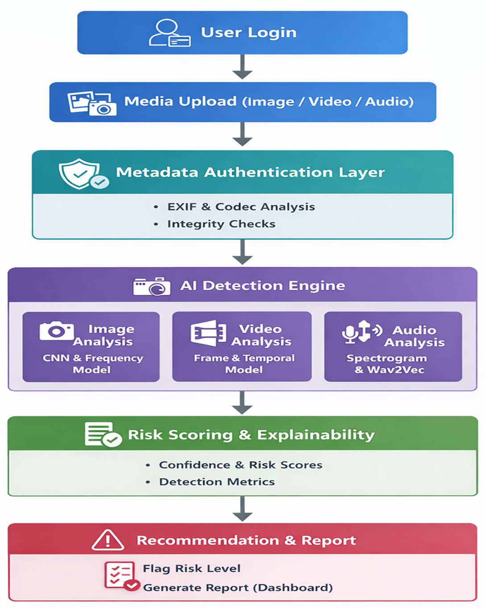
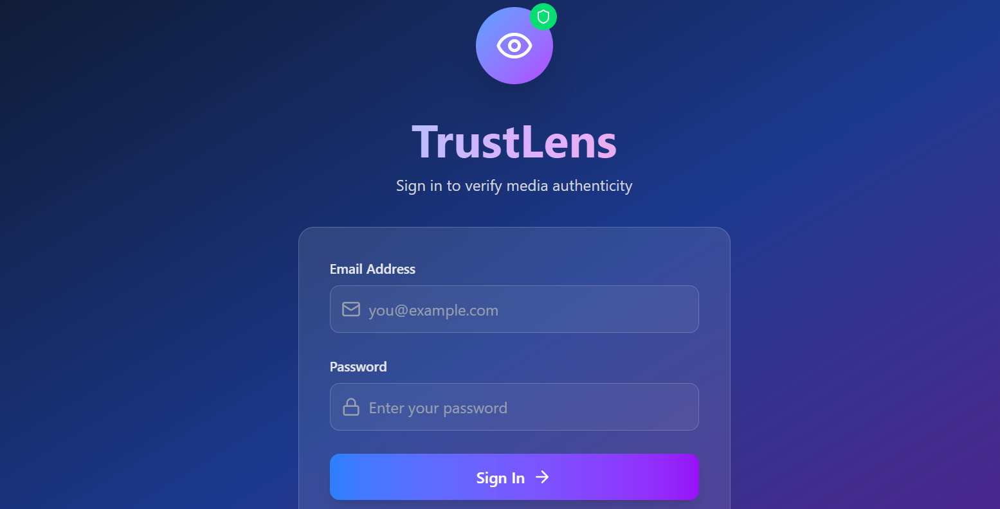
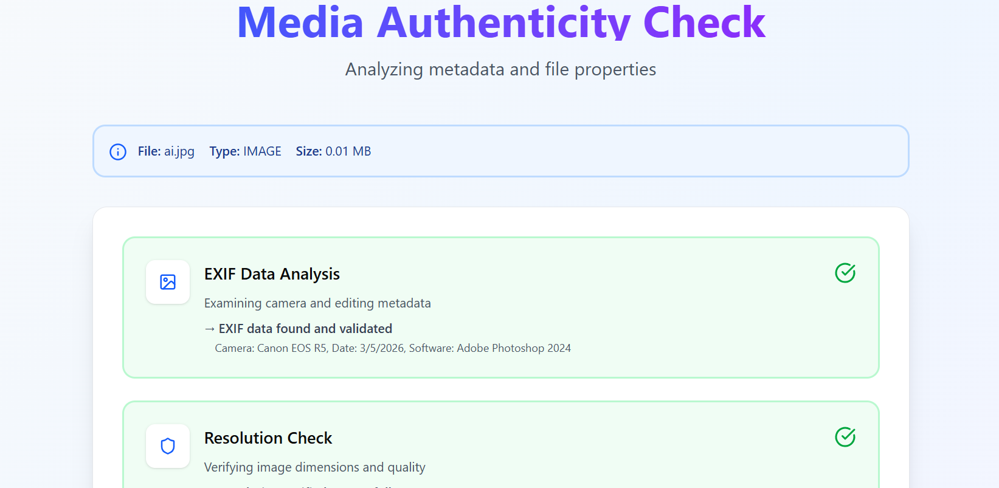
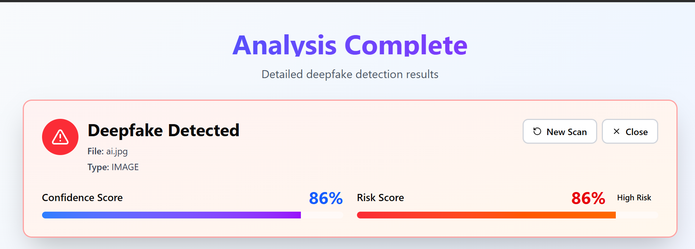
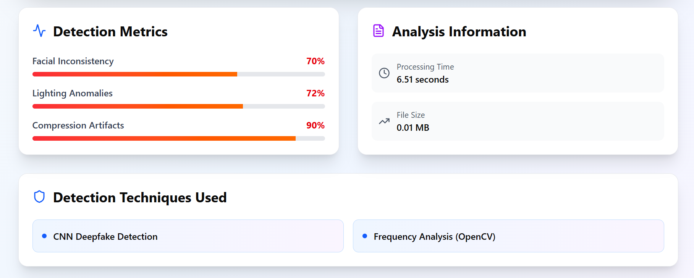
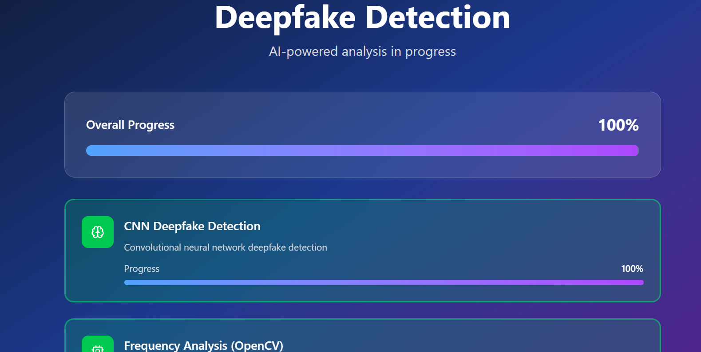
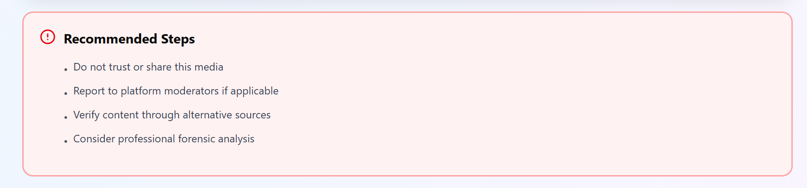

TrustLens – Deepfake Detection & Media Authenticity Verification

Overview: TrustLens is an AI-powered system designed to verify the authenticity of digital media and detect deepfake content. With the rapid growth of manipulated images and videos on social media, misinformation and identity misuse have become major concerns. It analyzes uploaded media and determines whether it is authentic or artificially manipulated. The system also ensures secure media verification through cryptographic hashing and encrypted data transmission.

Problem Statement: Deepfake technology has made it increasingly easy to create realistic but fake videos and images, leading to misinformation, fraud, and loss of trust in digital media. There is a need for a reliable system that can automatically verify media authenticity and detect deepfake manipulation.

Solution: TrustLens provides a two-stage verification system: ->Authenticity Verification: Checks if the media matches an existing trusted record using hash comparison. ->Deepfake Detection: If the media is not verified as authentic, the system analyzes it using AI-based deepfake detection models. This approach ensures that media is first validated for authenticity and then checked for manipulation, improving detection reliability.

Key Features: ->Deepfake detection using AI models ->Media authenticity verification through hashing ->Secure data transfer using HTTPS (Encryption in Transit) ->User-friendly interface for uploading and verifying media ->Fast and automated verification process

System Architecture:

Tech Stack:

->Frontend: HTML CSS JavaScript ->Backend: Python ->AI / Processing: EfficientNet Spectogram Wav2Vec Frequency Detector Temporal Detector Frame Detector ->Security: Hashing for media integrity HTTPS for encryption in transit AES encryption for secure data handling

Installation: Clone the repository:git clone https://github.com/snehahariharan16/Deepfake-.git

Navigate to the project folder: cd deepfake

Install dependencies: pip install -r requirements.txt

Run the application: python main.py
Demo Screenshots:

 Authentication

 Authenticity Check

 Deepfake Analysis

 Detection Metrics

Progress

Recommended Steps

Security Considerations: ->TrustLens integrates multiple security mechanisms: ->Hashing to verify media integrity ->Encryption in Transit (HTTPS/TLS) to protect data during transfer ->Secure backend processing to prevent unauthorized manipulation

Future Improvements: ->Real-time video deepfake detection ->Blockchain-based media authenticity tracking ->Integration with social media platforms ->Improved AI model accuracy

